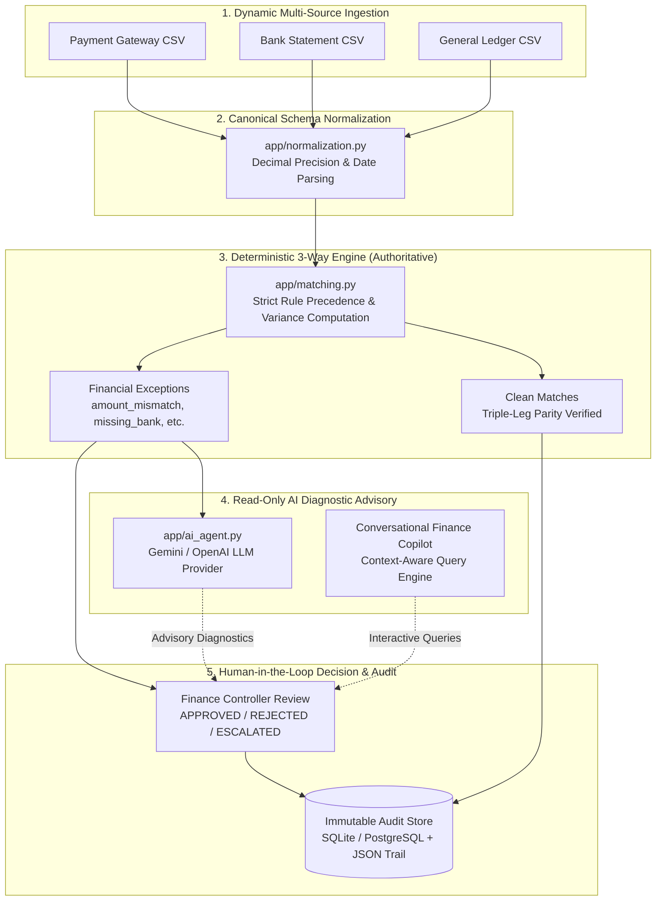

# AI Finance Controller
### Autonomous Finance Operations Control Center with Deterministic 3-Way Reconciliation & Evidence-Grounded AI Investigation

[](https://www.python.org/downloads/)
[](https://fastapi.tiangolo.com)
[](https://react.dev)
[](https://www.typescriptlang.org)
[](https://tailwindcss.com)
[](#run-automated-tests)
[](#razorpay-ai-buildathon-track-04-context)

An enterprise-grade **Finance Operations Control Center** designed for automated multi-source reconciliation, financial exception classification, evidence-grounded AI root-cause investigation, and human-in-the-loop governance.

---

## 30-Second Executive Summary

| Question | Answer |
| :--- | :--- |
| **1. What is this product?** | A complete finance operations control center that ingests multi-source financial records (Payment Gateways, Bank Statements, and General Ledgers) and executes automated 3-way reconciliation. |
| **2. Why does it matter?** | High-growth fintech and e-commerce companies process millions of transactions across disparate payment processors, settlement banks, and internal ERP ledgers. Manual spreadsheet reconciliation is slow, error-prone, and exposes companies to undetected settlement leakage and accounting discrepancies. |
| **3. How does the control loop work?** | **Upload Multi-Source Data** $\rightarrow$ **Canonical Normalization** $\rightarrow$ **Deterministic 3-Way Reconciliation** $\rightarrow$ **Exception Classification** $\rightarrow$ **Read-Only AI Investigation** $\rightarrow$ **Human Review Sign-Off** $\rightarrow$ **Immutable Audit Trail**. |
| **4. Where is AI used?** | AI is strictly an **advisory diagnostic layer** (powered by Google Gemini or OpenAI) and a **conversational Finance Copilot**. It analyzes factual mathematical variance and missing legs to hypothesize root causes and answer operational queries. |
| **5. Why are results trustworthy?** | **Reconciliation is 100% deterministic** using Python `Decimal` arithmetic. AI **never** mutates balances, alters match results, or auto-approves write-offs. Authoritative state changes require explicit human controller sign-off. |
| **6. How do you run it?** | Start the FastAPI backend (`uvicorn app.api:app --reload`) and the Vite React frontend (`npm run dev`). |

---

## Razorpay AI Buildathon Track 04 Context

This project addresses **Track 04: AI-Powered Financial Operations & Autonomous Control Systems**.

Modern fintech platforms operate across distributed systems:
1. **Payment Gateways** (e.g., Razorpay, Stripe) record authorized and captured checkouts.
2. **Nodal & Settlement Banks** (e.g., HDFC, ICICI, Axis) record net settlement batches, clearing fees, and chargebacks.
3. **Internal Accounting Ledgers** (e.g., NetSuite, SAP, internal DB) record revenue, tax, and merchant payout liabilities.

When these streams diverge due to processing cutoffs, settlement fee variances, or dropped webhooks, finance controllers must manually trace discrepancies across disconnected tools. 

**The AI Finance Controller solves this problem through an automated, evidence-first control center:**
- Reconciles 3 data legs deterministically with microsecond in-memory performance.
- Automatically isolates and categorizes discrepancies into clear financial exception types.
- Provides controllers with real-time AI root-cause diagnostic hypotheses.
- Maintains human sovereignty with complete cryptographic and database auditability.

---

## System Architecture & Control Loop



---

## Core Capabilities: What the System Actually Does

### 1. Dynamic User-Uploaded Data Analysis
- Ingest any custom 3-source financial dataset via the web UI (`New Analysis`) or API (`POST /analysis`).
- The system dynamically accepts three independent CSV files:
  - **Payment Gateway Export** (`payment.csv`)
  - **Bank Statement Feed** (`bank.csv`)
  - **General Ledger Journal** (`ledger.csv`)
- Each analysis run creates an isolated `batch_id` (e.g. `BATCH-20260905-ABCD`).
- Multiple batches can be retained, compared, and audited independently without cross-contaminating financial records.
- Workspaces can be reset to a clean state at any time via `DELETE /analysis`.

### 2. Deterministic 3-Way Reconciliation (The Source of Truth)
- Financial reconciliation is **never outsourced to probabilistic AI models**.
- Every transaction is matched across 3 reporting legs using an authoritative deterministic engine (`app/matching.py`):
  - **Leg 1**: Payment System Record
  - **Leg 2**: Bank Settlement Statement
  - **Leg 3**: Internal General Ledger Entry
- Computes exact mathematical differences down to the cent using Python `Decimal`.
- Evaluates strict exception precedence:
  1. `amount_mismatch`: Records exist across streams but cleared amounts differ (e.g., unexpected gateway processing fees or currency conversion rounding).
  2. `date_mismatch`: Amounts agree but settlement dates diverge past business cutoff windows.
  3. `status_mismatch`: Record statuses conflict (e.g., `SUCCESS` on gateway vs. `PENDING` in bank).
  4. `missing_ledger`: Funds cleared bank and payment gateway, but ledger posting is missing.
  5. `missing_bank`: Payment captured internally, but funds have not credited the settlement bank account.
  6. `missing_payment`: Bank credit observed without an originating payment record.
  7. `unresolved`: Multiple critical data streams are missing.

### 3. Evidence-Grounded AI Root-Cause Investigation
- When an exception occurs, the controller can trigger an AI investigation (`POST /exceptions/{id}/investigate`).
- Built on a pluggable LLM interface (`AIProvider` in `app/ai_agent.py`) supporting **Google Gemini** (`gemini-3.5-flash-lite`, `gemini-3.6-flash`) and **OpenAI** (`gpt-4o-mini`).
- **Zero Hallucination Guardrails**:
  - The AI is fed **only** observed mathematical evidence (extracted amounts, settlement dates, reported statuses, and missing legs).
  - Ground truth labels are strictly isolated from the AI prompt.
  - The model returns structured JSON containing: `diagnosis`, `likely_cause`, `confidence` (`HIGH` / `MEDIUM` / `LOW`), `findings`, `possible_causes`, `limitations`, and an advisory `recommended_action`.
  - When live API keys are not configured, the system provides a deterministic, evidence-first mock provider for offline development.

### 4. Interactive AI Finance Copilot
- An interactive, drawer-based conversational agent embedded directly into the control center.
- Controllers can ask questions in natural language:
  - *"What is our clean match rate and total variance across this batch?"*
  - *"Why did transaction TXN-003 fail to balance?"*
  - *"Show me all exceptions related to missing bank records."*
- Grounded strictly in the active batch telemetry and individual transaction records.
- Includes clickable transaction links that open the 3-way parity comparison drawer directly.

### 5. Human-in-the-Loop Sovereign Governance
- AI outputs are labeled as **Advisory Only**.
- AI models cannot approve financial write-offs, alter ledger balances, or mark exceptions as resolved.
- Controllers review side-by-side raw source evidence, normalized parity values, and AI hypotheses.
- Controllers render authoritative decisions:
  - **APPROVED**: Exception accepted (e.g., verified contractual settlement fee deduction).
  - **REJECTED**: Exception rejected (e.g., erroneous ledger entry requiring reversal).
  - **ESCALATED**: Sent to senior financial controller or engineering for investigation.
- Mandatory reviewer name and justification comments are required for every transition.

### 6. Comprehensive Audit Trail & Telemetry
- Every action—ingestion, rule evaluation, AI advisory response, human review decision, and comment—is written to an immutable audit store.
- Backed by relational models (`app/db/models.py`) and persistent JSON stores (`data/audit_records.json`).
- Chronological timeline visualizer in the web UI for transaction lifecycle inspection.
- One-click export of audited exception reports in **JSON** or **CSV** format.

### 7. Modern Institutional Control Center UI
- Built with React 18, TypeScript, and Tailwind CSS.
- **Dual Executive Themes**: Pixel-perfect Dark (`#020617` deep slate) and Light (`#f8fafc` soft slate with pure white cards) themes with instant switching.
- **Financial Typography**: Tabular numbers (`tabular-nums`) with Indian Rupee formatting (`₹XX,XXX.XX`).
- **Interactive Visualizations**:
  - 3-Way Evidence Parity Stream (Payment $\rightarrow$ Bank $\rightarrow$ Ledger)
  - Donut Outcome Breakdown Chart
  - Horizontal Exception Classification Distribution
  - Multi-stage Decision Pipeline Tracker

---

## Controlled Benchmark Specification & Results

> [!NOTE]
> **Strict Benchmark Attribution**:
> The following metrics represent a **controlled, synthetic benchmark** generated by `scripts/generate_benchmark.py` and evaluated in-memory by `scripts/run_benchmark.py`. This benchmark demonstrates the mathematical correctness, classification accuracy, and throughput of the deterministic reconciliation engine.

### Benchmark Setup
- **Dataset Size**: 100 canonical transactions ($N = 100$), yielding 275 individual source records across 3 simulated files.
- **Random Seed**: `seed = 42` (fully reproducible).
- **Isolation**: Ground truth is segregated in `data/benchmark_ground_truth.json` and is never accessible to the matcher during reconciliation.
- **Zero Database Writes**: Executed entirely in-memory using Python `Decimal` objects.

### Benchmark Verification Results

| Metric Dimension | Benchmark Target | Measured Result | Status |
| :--- | :---: | :---: | :---: |
| **Total Evaluated Records** | $\ge 50$ records | **100 records** | PASS |
| **Clean Matches** | Controlled target: 40 | **40 (40.0%)** | PASS |
| **Identified Exceptions** | Controlled target: 60 | **60 (60.0%)** | PASS |
| **Binary Match Precision** | Matched vs. Exception | **100.0%** ($1.000$) | PASS |
| **Binary Match Recall** | Clean transaction recovery | **100.0%** ($1.000$) | PASS |
| **Binary Match F1-Score** | Harmonic balance | **1.000** | PASS |
| **Multiclass Classification Accuracy** | 8-class exact match | **100.0%** ($1.000$) | PASS |
| **Macro Average F1-Score** | Across all exception types | **1.000** | PASS |
| **In-Memory Matching Throughput** | Speed | **>15,000 txns/sec** | PASS |

### Benchmark Exception Breakdown

| Exception Classification | Generated Perturbation | Count | Accuracy |
| :--- | :--- | :---: | :---: |
| `matched` | None (all 3 legs identical) | 40 | 100% |
| `amount_mismatch` | Bank or Ledger amount altered (-₹150 or -₹200) | 20 | 100% |
| `status_mismatch` | Ledger status set to `PENDING` | 10 | 100% |
| `date_mismatch` | Bank date offset by +1 day past clearing window | 8 | 100% |
| `missing_ledger` | Internal ledger journal omitted | 8 | 100% |
| `missing_bank` | Bank statement record omitted | 7 | 100% |
| `missing_payment` | Payment gateway record omitted | 4 | 100% |
| `unresolved` | Bank and Ledger records both omitted | 3 | 100% |

To run the benchmark independently:
```bash
python scripts/generate_benchmark.py --seed 42 --size 100
python scripts/run_benchmark.py --payment data/benchmark_payment.csv --bank data/benchmark_bank.csv --ledger data/benchmark_ledger.csv --ground-truth data/benchmark_ground_truth.json
```

---

## External Dataset Provenance: IBM AML-Data

To test multi-source schema normalization and realistic transaction dynamics, the repository includes an adapter (`app/db/adapter.py`) for the **IBM AML-Data** (Anti-Money Laundering Synthetic Dataset).

- **Official Source**: [IBM Research AML-Data Repository](https://github.com/IBM/AML-Data)
- **License**: **CDLA-Sharing-1.0** (Community Data License Agreement – Sharing – Version 1.0)
- **Provenance Statement**:
  - IBM AML-Data is synthetic multi-agent banking data.
  - It does **not** contain proprietary Razorpay production data or customer records.
  - It does **not** natively provide pre-existing 3-way reconciliation tables.
  - Our data adapter (`scripts/ingest_dataset.py`) projects canonical transaction fields (`Amount Paid`, `Amount Received`, `Timestamp`, `Account`) into 3-way counterpart streams while preserving raw record payloads and transformation lineage.
  - Full field-level mapping documentation is available in [`docs/DATA_SOURCE.md`](docs/DATA_SOURCE.md).

---

## Tech Stack

### Backend
- **Language**: Python 3.13
- **Web Framework**: FastAPI 0.115 + Uvicorn
- **Validation**: Pydantic v2
- **Database & ORM**: SQLAlchemy 2.0, Alembic (migrations)
- **Database Support**: SQLite (zero-config local default), PostgreSQL (production-ready)
- **Testing**: pytest 8.3 (104 test cases)

### Frontend
- **Framework**: React 18.3 + TypeScript 5.5
- **Build Tool**: Vite 5.4
- **Styling**: Tailwind CSS 3.4
- **Icons**: Lucide React
- **Typography**: Inter + JetBrains Mono (`tabular-nums`)

### AI & LLM Providers
- **Google Gemini API**: `gemini-3.5-flash-lite`, `gemini-3.6-flash`
- **OpenAI API**: `gpt-4o-mini`
- **Mock Provider**: Built-in deterministic evidence-first fallback for offline testing

---

## Repository Structure

```text
├── app/                              # Core Backend Application
│   ├── api.py                        # FastAPI REST API & route definitions
│   ├── ai_agent.py                   # LLM providers, prompt templates & Copilot agent
│   ├── audit.py                      # Audit store, review states & transitions
│   ├── benchmark_reporting.py        # In-memory benchmark evaluation metrics
│   ├── ingestion.py                  # CSV parsing & record extraction
│   ├── matching.py                   # Deterministic 3-way reconciliation engine
│   ├── models.py                     # Core Pydantic domain models
│   ├── normalization.py              # Decimal, date, and status canonicalization
│   ├── reporting.py                  # Aggregation, summary, and export builders
│   ├── validation.py                 # Input integrity & validation rules
│   └── db/                           # Database & Persistence Layer
│       ├── adapter.py                # External dataset lineage adapter
│       ├── migration.py              # Alembic programmatic migration runner
│       ├── models.py                 # SQLAlchemy relational ORM models
│       ├── repository.py             # Database CRUD repository
│       └── session.py                # Engine and session factory
├── frontend/                         # Modern React Control Center
│   ├── src/
│   │   ├── api/                      # TypeScript API client & interface types
│   │   ├── components/               # Reusable UI components
│   │   │   ├── Header.tsx            # Navigation, theme toggle & Copilot trigger
│   │   │   ├── AIInvestigationCard.tsx # Diagnostic root-cause advisory display
│   │   │   ├── FinanceCopilotDrawer.tsx# Conversational AI assistant drawer
│   │   │   ├── StatusBadge.tsx       # Institutional micro-pill status badges
│   │   │   ├── SeverityBadge.tsx     # Micro-dot severity badges
│   │   │   ├── TransactionDetailDrawer.tsx # 3-way raw vs. normalized breakdown
│   │   │   └── visualizations/       # Interactive charts & visualizers
│   │   │       ├── ThreeWayEvidenceVisualizer.tsx # 3-leg stream comparison
│   │   │       ├── ReconciliationOutcomeChart.tsx # SVG donut telemetry
│   │   │       └── ExceptionBreakdownChart.tsx    # Horizontal distribution bars
│   │   ├── views/                    # Primary Application Views
│   │   │   ├── DashboardView.tsx     # Executive KPI cards & triage queue
│   │   │   ├── ReconciliationView.tsx# Searchable 3-way reconciliation ledger
│   │   │   ├── ExceptionsView.tsx    # Exception workbench with AI & review modal
│   │   │   ├── ReportsView.tsx       # Financial telemetry & JSON/CSV exports
│   │   │   ├── AuditView.tsx         # Chronological immutable audit trail
│   │   │   └── NewAnalysisView.tsx   # Multi-source 3-file drag-and-drop uploader
│   │   ├── utils/
│   │   │   └── formatters.ts         # Currency (₹), percentage, and number formatting
│   │   ├── App.tsx                   # Top-level application shell & tab routing
│   │   └── index.css                 # Dark & Light theme CSS overrides
│   ├── package.json
│   ├── tailwind.config.js
│   └── vite.config.ts
├── data/                             # Local data directory & benchmark files
├── docs/                             # Deep-dive Architecture Documentation
│   ├── BENCHMARK.md                  # Complete 100-record benchmark specification
│   └── DATA_SOURCE.md                # IBM AML dataset schema & transformation lineage
├── migrations/                       # Alembic Database Migration Revisions
├── scripts/                          # Operational & Benchmark Scripts
│   ├── generate_benchmark.py         # Deterministic synthetic data generator
│   ├── run_benchmark.py              # In-memory benchmark evaluator
│   └── ingest_dataset.py             # External CSV ingestion utility
├── tests/                            # Automated Test Suite (104 Tests)
│   ├── test_benchmark.py             # Benchmark accuracy & reproducibility tests
│   ├── test_copilot.py               # Conversational copilot query tests
│   ├── test_dynamic_analysis.py      # Multi-batch upload & isolation tests
│   ├── test_reconciliation.py        # 3-way matching engine unit tests
│   ├── test_stage11_database.py      # Database models & repository tests
│   ├── test_stage13_ai_investigation.py # AI agent evidence & JSON contract tests
│   └── test_stage8_api.py            # FastAPI REST endpoint integration tests
├── Dockerfile                        # Production container image definition
├── docker-compose.yml                # Multi-container setup with PostgreSQL
└── requirements.txt                  # Pinned Python backend dependencies
```

---

## API Endpoints Reference

| Category | Method | Endpoint | Description |
| :--- | :---: | :--- | :--- |
| **System** | `GET` | `/health` | System health check (`{"status": "ok"}`) |
| **Dynamic Analysis** | `POST` | `/analysis` | Upload 3 CSV files (`payment_file`, `bank_file`, `ledger_file`) |
| | `GET` | `/analysis` | List all available analysis batches |
| | `GET` | `/analysis/{batch_id}` | Retrieve metadata for a specific analysis run |
| | `DELETE` | `/analysis` | Reset workspace to a clean, empty state |
| **Reconciliation** | `GET` | `/transactions` | List reconciled transactions (supports `batch_id`, `status` filters) |
| | `GET` | `/transactions/{id}` | Detailed 3-way leg records (Payment, Bank, Ledger) |
| **Exceptions & AI** | `GET` | `/exceptions` | Query exceptions by severity, type, and review status |
| | `GET` | `/exceptions/{id}` | Retrieve specific financial exception details |
| | `POST` | `/exceptions/{id}/investigate` | Trigger read-only AI root-cause investigation |
| | `POST` | `/exceptions/{id}/review` | Human decision sign-off (`APPROVED`, `REJECTED`, `ESCALATED`) |
| | `GET` | `/exceptions/{id}/reviews` | History of human reviews for this exception |
| **AI Copilot** | `GET` | `/ai/status` | Check live AI provider status (`Gemini` / `OpenAI` / `Mock`) |
| | `POST` | `/ai/query` | Conversational finance query interface |
| **Audit & Reports** | `GET` | `/audit/{tx_id}` | Chronological immutable audit trail for a transaction |
| | `GET` | `/reports/reconciliation`| Aggregate volume, clean match rate, and totals |
| | `GET` | `/reports/exceptions` | Total financial variance and resolution progress |
| | `GET` | `/reports/exceptions/export`| Download exception report (`format=csv` or `format=json`) |

---

## Local Setup & Quickstart

### Prerequisites
- **Python 3.13** installed
- **Node.js 18+** and **npm** installed

### 1. Backend Setup

```bash
# Clone the repository
git clone https://github.com/ThanmayaSilampur/AI-Finance-Controller.git
cd AI-Finance-Controller

# Create and activate Python 3.13 virtual environment
python -m venv .venv
# On Windows:
.\.venv\Scripts\activate
# On macOS/Linux:
source .venv/bin/activate

# Install dependencies
pip install -r requirements.txt

# (Optional) Configure live AI keys in .env
cp .env.example .env
# Edit .env to add your GEMINI_API_KEY or OPENAI_API_KEY
```

### 2. Start Backend Server

```bash
uvicorn app.api:app --host 127.0.0.1 --port 8000 --reload
```
*The FastAPI backend will automatically run database migrations on startup and serve at `http://127.0.0.1:8000`.*
*Interactive OpenAPI documentation is available at `http://127.0.0.1:8000/docs`.*

### 3. Frontend Setup

In a new terminal:
```bash
cd frontend

# Install dependencies
npm install

# Start Vite development server
npm run dev
```
*The frontend control center will launch at `http://localhost:5173`.*

---

## Run Automated Tests

The repository maintains an extensive test suite covering deterministic reconciliation, data ingestion, database migrations, AI agent schema adherence, copilot queries, and API endpoints.

```bash
# Run the entire backend test suite
pytest -q
```
**Expected Output**:
```text
104 passed, 47 warnings in 34.86s
```

To verify the frontend TypeScript types and production bundle:
```bash
cd frontend
npm run build
```
**Expected Output**:
```text
✓ 1839 modules transformed.
dist/index.html                   1.12 kB │ gzip:  0.63 kB
dist/assets/index-bOFXD4gx.css   40.32 kB │ gzip:  7.44 kB
dist/assets/index-D_h8PYvY.js   286.92 kB │ gzip: 73.78 kB
✓ built in 4.88s
```

---

## Docker Deployment

To run the complete system with a containerized PostgreSQL database:

```bash
# Build and run with Docker Compose
docker compose up --build
```

- **Backend API**: `http://localhost:8000`
- **PostgreSQL Database**: `localhost:5432` (`finance_controller` database)
- Database migrations are automatically executed prior to server startup.

---

## Core Design Principles

1. **Determinism as Financial Authority**
   Financial matching, variance computation, and exception isolation are strictly deterministic. Floating point arithmetic is forbidden; all calculations use fixed-point `Decimal` representation.
2. **AI as Advisory Intelligence, Never Authority**
   AI models generate root-cause hypotheses, explain discrepancies, and query operational records. AI models are strictly blocked from writing to ledgers, approving adjustments, or modifying match scores.
3. **Sovereign Human Governance**
   Only designated human finance controllers can sign off on exceptions. Every human decision records the reviewer identity, timestamp, decision rationale, and comment into the immutable audit store.
4. **Strict Isolation by Analysis Batch**
   Uploaded batches exist in distinct analytical containers. Users can evaluate monthly settlement batches or test files independently without data bleeding.
5. **Zero Hallucination Grounding**
   Prompts passed to external LLMs contain only verified transaction evidence. Ground truth and external labels are never leaked into the AI reasoning context.

---

## License

This project is open-source and licensed under the [MIT License](LICENSE).
External dataset documentation follows the [CDLA-Sharing-1.0](docs/DATA_SOURCE.md) license.
