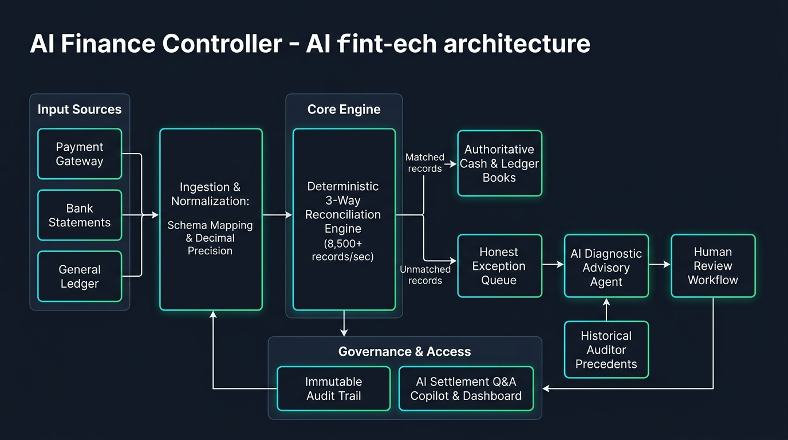

# AI Finance Controller
### Autonomous Finance Operations Control Center | Razorpay AI Buildathon (Track 04)

An enterprise finance-ops control platform that closes the loop across multi-source financial records (Payment Gateway, Bank Statement, and General Ledger) by pairing a **high-throughput deterministic 3-way reconciliation engine** with an **evidence-grounded AI diagnostic agent**.

---

## System Architecture

---

## Problem Statement

> **The 2026 Builder Consensus:** In financial operations, **verification capacity, not generation speed, is the bottleneck.** Reconciliation, settlement variance detection, and cash positioning are still performed manually in spreadsheets.

When payment gateways, nodal settlement banks, and ERP ledgers diverge, financial teams face manual tracing, delayed books, and unverified cash balances.

**Our Approach:**
- **Zero-Hallucination Deterministic Core:** Reconciliation and math are 100% deterministic using Python Decimal precision. LLMs **never** calculate balances or mutate ledger states.
- **Evidence-Grounded AI Advisory:** LLMs (Gemini / OpenAI) are constrained strictly to diagnosing isolated exceptions using multi-stream evidence, signature caching, and historical human precedents.
- **Human-in-the-Loop Governance:** Human controllers retain final authority (APPROVE, REJECT, ESCALATE) backed by an immutable audit trail.

---

## The Closed Finance-Ops Loop

`
[Payment Gateway]  ──┐
[Bank Statement]   ──┼──> [Ingestion & Normalization] ──> [Deterministic 3-Way Match (8,500+ rec/s)]
[General Ledger]   ──┘           (ISO 8601, Decimal)                      │
                                                               ┌──────────┴──────────┐
                                                               ▼                     ▼
                                                        [Matched Parity]     [Honest Exceptions]
                                                               │                     │
                                                               ▼                     ▼
                                                       [Cash & Books]       [AI Diagnostic Agent]
                                                               │           (RAG Precedents & Cache)
                                                               │                     │
                                                               ▼                     ▼
                                                    [Settlement Copilot] ◄── [Human Sign-Off & Audit]
`

1. **Ingest & Normalize:** Ingests dynamic CSV files from Payment Gateways, Banks, and Ledgers with schema mapping and strict Decimal precision.
2. **Deterministic 3-Way Match:** Computes exact triple-leg parity, settlement clearing tolerance (+1 / T+2$), and duplicate reference collisions.
3. **Honest Exception Isolation:** Automatically categorizes unmatched records (mount_mismatch, missing_bank, missing_ledger, 	iming_delay, duplicate_reference).
4. **AI Investigation:** Autonomous agent inspects 3-stream factual evidence and retrieves past human auditor precedents to explain root causes.
5. **Human Review & Immutable Audit:** Controllers review decisions, sign off, and record cryptographically timestamped audit entries.
6. **Settlement Q&A Copilot:** Natural-language conversational interface over the active batch\'s cash position, discrepancies, and audit history.

---

## Tech Stack

- **Backend:** Python 3.13, FastAPI, SQLAlchemy 2.0, Pydantic v2, SQLite / PostgreSQL, Alembic.
- **Frontend:** React 18, TypeScript 5.5, Vite, Tailwind CSS, Lucide Icons.
- **AI Layer:** Google Gemini / OpenAI (configurable), in-memory diagnostic signature cache, RAG precedent retrieval.

---

## Quick Start

### 1. Prerequisites & Installation
`ash
# Clone the repository
git clone https://github.com/ThanmayaSilampur/AI-Finance-Controller.git
cd AI-Finance-Controller

# Set up Python virtual environment
python -m venv .venv
source .venv/bin/activate  # On Windows: .venv\Scripts\activate
pip install -r requirements.txt
`

### 2. Configure Environment (Optional for Live AI)
`ash
cp .env.example .env
# Add your GEMINI_API_KEY or OPENAI_API_KEY (defaults to MockAIProvider if unset)
`

### 3. Run Backend & Frontend
`ash
# Terminal 1: Backend API (FastAPI)
uvicorn app.api:app --host 127.0.0.1 --port 8000 --reload

# Terminal 2: Frontend Control Center (Vite)
cd frontend
npm install
npm run dev
`

- **Web UI:** http://localhost:5173
- **Interactive API Docs:** http://127.0.0.1:8000/docs

### 4. Run Automated Tests & Benchmark
`ash
# Run the complete test suite (108 tests)
pytest

# Run the CLI throughput benchmark
python -m app.cli benchmark
`
